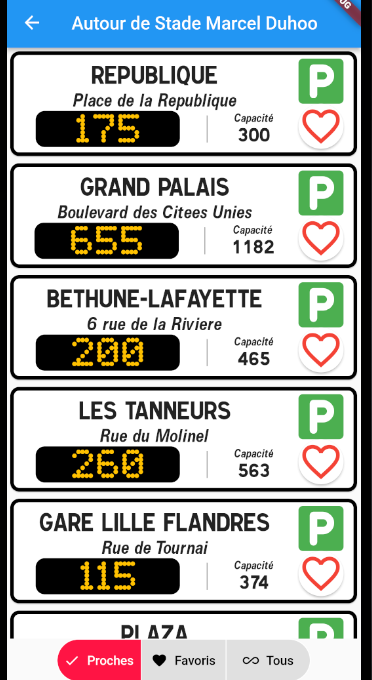

# MELParking

*Antoine AGRÉ, 5A ICy, INSA Hauts-de-France*

Application mobile simple, utilisant le framework Flutter.

Réalisée dans le cadre du cours **Compilation et développement d'applications mobiles** (INSA Hauts-de-France, Spécialité Informatique et Cybersécurité, 5ème année)

Le but était d'utiliser le portail open data de la MEL (Métropole européenne de Lille), qui fournit des [données en temps réel sur l'occupation de ses parkings](https://opendata.lillemetropole.fr/explore/dataset/disponibilite-parkings/information/), pour proposer une application permettant de recommander un parking à un conducteur.

### Objectifs principaux du projet

- Acquérir des données distantes et adapter les recommandations formulées au conducteur en fonction des mises à jour des données.

- Stocker des informations localement (les parkings favoris ainsi que les destinations préférées du conducteur par exemple).

### Format du rendu

Le code source est disponible sur le [dépôt Github](https://github.com/antoine-agre/MELParking). Ce fichier README constitue le rapport du projet, et sera fourni au format `pdf`.

---

## Interface

L'interface de l'application est organisée autour de 4 pages, accessibles par des onglets en haut de l'écran. Ils sont cliquables, et l'utilisateur peut également naviguer en swipant vers la gauche ou la droite (en-dehors de la carte).

### L'onglet "Parkings"

L'onglet "Parkings" présente la liste des parkings, que l'utilisateur peut organiser de différentes façons en utilisant des boutons en bas de l'écran : par ordre de recommandation selon sa localisation, avec filtre des favoris, ou par ordre alphabétique.

Chaque parking est représenté par un panneau regroupant les éléments suivants :

- Nom du parking ;
- Adresse du parking ;
- Affichage du statut (en orange) : nombre de place si le parking est ouvert, son statut sinon ;
- Capacité totale du parking ;
- [Le code couleur](#le-code-couleur) permettant de juger la capacité du parking en un coup d'oeil;
- Bouton permettant d'indiquer un parking comme favori.

Un appui sur un de ces panneaux redirigera l'utilisateur vers le service Google Maps, qui ouvrira un itinéraire vers le parking choisi.

L'utilisateur peut demander manuellement de rafraîchir la liste avec un glissement vers le bas. Sinon, cette opération est effectuée au lancement de l'application, puis chaque minute.

#### Le code couleur

Le code couleur utilisé dans l'application est le suivant :

- **Noir :** le parking n'est pas disponible ;
- **Rouge :** le parking est presque plein (moins de 5% de sa capacité et/ou moins de 20 places disponibles) ;
- **Orange :** le parking risque d'être plein dans le futur (moins de 20% de sa capacité disponible) ;
- **Vert :** le parking est disponible avec une capacité suffisante (plus de 20% de sa capacité disponible).

#### Le choix de l'ordre d'affichage

Des boutons permettent à l'utilisateur de choisir quels parkings afficher et dans quel ordre :

- **"Proches" :** affiche tous les parkings, dans un ordre de recommandation expliqué ci-dessous ;
- **"Favoris" :** affiche uniquement les parkings favoris, dans le même ordre de recommandation ;
- **"Tous" :** affiche tous les parkings, par ordre alphabétique.

L'ordre d'affichage des parkings est déterminé de la manière suivante :

- Chaque parking est doté d'un score, qui est d'abord la **distance euclidienne entre la position de l'utilisateur et le parking** (calculé en utilisant la latitude et longitude de chaque emplacement) ;
- Les parkings **indisponibles** (code couleur noir) sont dotés d'un score infini, afin de les reléguer à la fin de la liste ;
- Les parkings **risquant de ne plus être disponibles** (code couleur rouge) voient leur distance multipliée par 2 (facteur à adapter selon les résultats obtenus).

Les parkings sont ensuite triés du score le plus petit au plus grand.

### L'onglet "Carte"

L'onglet "Carte" présente une carte en utilisant le service open source [*OpenStreetMap*](https://www.openstreetmap.org). Elle affiche les parkings, la position de l'utilisateur si elle est activée, et la position de ses lieux favoris si l'utilisateur le souhaite.

Le bouton au coin supérieur droit permet d'afficher ou non les lieux favoris, et le bouton au coin inférieur droit permet de centrer la carte sur l'utilisateur ou, si sa localisation n'est pas activée, sur la ville de Lille.

Un appui sur un élément de la carte aura le même effet qu'un appui dans leurs listes respectives (liste des parkings ou liste des lieux favoris).

### L'onglet "Lieux"

L'onglet "Lieux" permet à l'utilisateur d'ajouter et de retrouver ses lieux favoris. Ils pourront être affichés sur la carte, et un appui ouvrira une liste des parkings autour du lieu.

Un glissement vers la gauche permet de supprimer un lieu. Le bouton à gauche permet de modifier le nom donné à un lieu. Un appui long permet de réorganiser dans n'importer quel order. Les lieux favoris, leur nom et l'ordre de la liste sont conservés localement.

#### Ajout d'un lieu

Un bouton flottant permet d'ouvrir un dialogue et d'ajouter un nouveau lieu favori.

L'utilisateur rentre le nom d'un lieu ou d'une adresse, qui sera utilisé pour retrouver des coordonnées sur la carte. Une fois le lieu sauvegardé, l'utilisateur peut modifier le nom donné à ce lieu sans changer ses coordonnées.

#### Affichage des parkings autour d'un lieu

Un appui sur un lieu favori permet à l'utilisateur d'avoir un aperçu des parkings environnants. Il s'agit de la même interface que dans l'onglet "Parkings", à la différence que les parkings classés selon leur distance au lieu lui-même.

### L'onglet "GPS"

L'onglet "GPS" affiche le statut de la localisation de l'utilisateur, et lui permet de l'activer.

Lors de l'appui sur le bouton central, l'application demandera à l'utilisateur d'activer le service de localisation de son téléphone et/ou d'autoriser l'application d'y accéder, le cas échéant.

## Code source

Le code source de l'application (répertoire `/lib`) est organisé de la façon suivante :

- `main.dart`
- models
    - `DataModel.dart`
    - `Parking.dart`
    - `Place.dart`
- widgets
    - `LocationScreen.dart`
    - `MapScreen.dart`
    - `ParkingCard.dart`
    - `ParkingList.dart`
    - `PlacesScreen.dart`

### `main.dart`

Point d'entrée principal de l'application.

### `DataModel.dart`

Définit le `ChangeNotifier` utilisé pour représenter l'état de l'application. Contient les données et les méthodes utilisées dans toute l'application pour mettre à jour son état.

### `Parking.dart`

Définit la classe utilisée pour représenter un parking.

### `Place.dart`

Définit la classe utilisée pour représenter un lieu.

### `LocationScreen.dart`

Définit le widget représentant l'écran de localisation.

### `MapScreen.dart`

Définit le widget représentant la carte.

### `ParkingCard.dart`

Définit le widget représentant un panneau de parking, utilisé dans les listes des parkings.

### `ParkingList.dart`

Définit le widget représentant une liste des parkings.

### `PlacesScreen.dart`

Définit le widget représentant la liste des lieux favoris.

## Dépendances

Packages utilisés :

- `http` : permet de manipuler des requêtes HTTP, utilisé pour accéder à l'API des parkings ;
- `provider` : permet de faciliter le partage de l'état de l'application ;
- `shared_preferences` : permet de sauvegarder des données légères localement ;
- `flutter_native_splash` : permet de personnaliser le splash screen de l'application ;
- `geolocator` : permet d'accéder au service de localisation du téléphone ;
- `url_launcher` : permet d'ouvrir des URL, notamment pour utiliser les services de Google Maps ;
- `flutter_map` : permet d'utiliser [OpenStreetMap](https://www.openstreetmap.org) pour construire une carte interactive ;
    - `latlong2` : utilisé par `flutter_map` pour représenter des coordonnées géographiques ;
- `geocoding` : permet de rechercher des coordonnées géographiques à partir d'un nom ou d'une adresse.

## Implémentation des fonctionnalités

### Gestion de l'état de l'application

L'état de l'application contient les données suivantes :

- `parkingList` : la liste des parkings récupérée grâce à l'API ;
- `lastUpdated` : la date et l'heure de la dernière mise à jour des données (inutilisée pour l'instant) ;
- `userPosition` : la localisation de l'utilisateur, ou `null` le cas échéant ;
- `placeList` : la liste des lieux favoris de l'utilisateur.

La gestion de l'état de l'application est surtout implémenté dans la classe `DataModel`, qui est un `ChangeNotifier`. On utilise le package `provider`, qui permet de simplifier la manipulation de `InheritedWidget`.

Ainsi, les parties de l'application qui doivent réagir à son état sont placées dans un widget `Consumer<DataModel>`, et seront reconstruites à chaque modification de l'état (à l'appel de `notifyListeners()`).

Il est aussi possible d'accéder à cet état en utilisant `Provider.of<DataModel>()`, s'il n'est pas nécessaire pour cette partie de l'interface d'être notifiée et/ou reconstruites à chaque évolution de l'état.

Les `SharedPreferences` sont utilisées pour sauvegarder des données persistantes localement, car nous n'avons pas besoin d'en stocker beaucoup : seulement une liste de chaînes de caractères représentant les IDs des parkings favoris, et des objets JSON représentant le nom et les coordonnées géographiques des lieux favoris.

Le singleton `DataModel` est instancié dans `main.dart` au lancement de l'application. Il est ensuite passé au `ChangeNotifierProvider`, en haut de l'arbre des widgets, ce qui permet à toutes les parties de l'application d'y accéder comme précisé ci-dessus.

### Liste des parkings

La liste des parkings (implémentée dans `ParkingList.dart`) est placée dans un `Consumer<DataModel>`, et est donc reconstruite à chaque modification de l'état de l'application.

Le widget utilisé dans l'onglet "Parkings" est initialisé sans arguments. Les arguments `customPosition` et `placeName` sont utilisés uniquement lors de l'affichage des parkings proches d'un lieu : ils permettent de préciser la position à utiliser à la place de celle de l'utilisateur, et le nom du lieu.

Lorsque le widget est construit, il récupère la liste des parkings et la modifie selon plusieurs critères. Dans un premier temps, si l'argument `customPosition` est non-nul, les distances sont recalculées pour refléter la nouvelle position de référence. Ensuite, selon le mode de tri choisi, la liste est mise à jour et triée. 

### Parkings favoris

Chaque parking possède un attribut booléen `favorite` indiquant s'il est choisi comme favori.

Lorsque l'application récupère la liste des parkings via l'API, elle reconstruit chaque objet `Parking`, et doit donc restaurer la valeur de leur attribut `favorite` depuis les `SharedPreferences`.

La méthode `Parking.toggleFavorite()` modifie directement les `SharedPreferences` pour les garder à jour.

### Localisation de l'utilisateur

La localisation est gérée dans `DataModel` en utilisant le package `geolocator`. Il s'agit surtout de vérifier et demander les autorisations nécessaires lorsque l'utilisateur utilise le bouton de l'onglet "GPS", puis de mettre à jour régulièrement `userPosition`.

### Carte

La carte est définie dans `MapScreen`, et s'appuie sur le package `flutter_map`.

On utilise un `Stack` pour créer les boutons par-dessus la carte. La carte est formée de plusieurs couches : un `TileLayer`, qui affiche les parties de la carte récupérées sur les serveurs de OpenStreetMap ; et un `MarkerLayer`, contenant les marqueurs utilisés (parkings, utilisateur, et lieux).

### Lieux favoris

L'état de l'application contient une liste des lieux favoris, des objets de la classe `Place`, de la même façon que pour les parkings.

Le package `geocoding` est utilisé pour convertir un nom de lieu ou une adresse en coordonnées géographique.

## Pistes d'amélioration

### Corrections

L'utilisation de OpenStreetMap doit être amélioré, notamment en sauvegardant les tiles dans le cache de l'application, pour respecter les conditions d'utilisation du projet. Pour la même raison, il faut ajouter une couche spéciale à la carte pour orienter l'utilisateur vers la page de copyright.

Un certain nombre de bugs sont encore présents dans l'application, notamment pour ce qui est du traitement du service de localisation. En particulier, si l'utilisateur désactive sa localisation, des erreurs peuvent apparaître.

D'une façon plus générale, il reste des erreurs non-traitées dans l'application.

### Fonctionnalités à améliorer

Le service de géocoding utilisé est celui fourni par Android (ou iOS), mais ils ont des limites. Il faudra chercher à limiter son utilisation, ou utiliser un autre service plus adapté.

Le code a besoin d'être revu, car beaucoup de fonctionnalités sont définies à des endroits différents et non-cohérents entre eux : dans `DataModel`, dans les modèles de données, ou directement dans les widgets.

La liste des parkings est trop manipulée à chaque mise à jour des données, ou lors du déplacement dans l'UI. Il serait judicieux de réfléchir à cet aspect, afin d'améliorer les performances de l'application.

Lors de l'ajout d'un lieu préféré, aucune suggestion ni confirmation n'est affichée. L'utilisation d'une API comme celle de Google Maps pourrait permettre à l'utilisateur un choix plus facile et plus clair du lieu souhaité.

Les recommandations de parkings, notamment le code couleur, ne sont pas expliqués dans l'application. L'interface devrait être plus explicite, et l'implémentation d'un tutoriel peut être envisagée.

L'interface de la carte pourrait être amélioré, avec des marqueurs plus visibles ou des boutons permettant de contrôler le zoom et la rotation par exemple.
